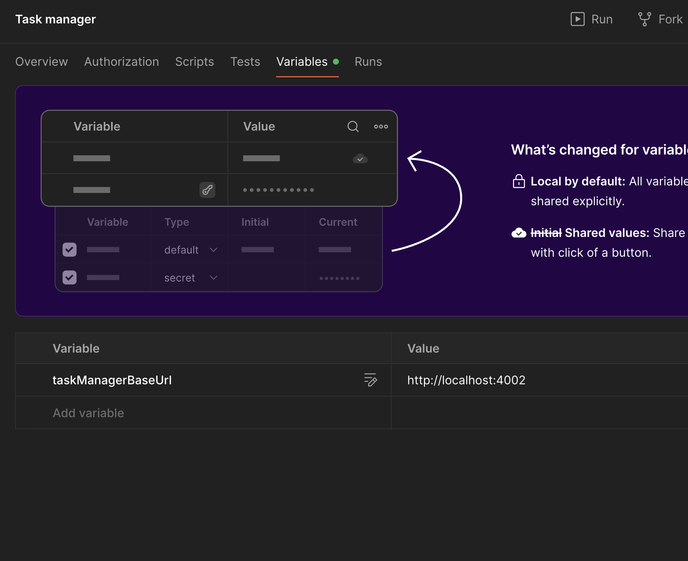

# Task Manager

A modular Task Manager backend built with NestJS, following a Feature-Based Clean Architecture.
It demonstrates how to separate business rules, use cases, and framework concerns for maintainability and scalability.

---

## Project Overview

This project manages Tasks and Users, implementing strict architectural boundaries:
- Domain layer for core business logic
- Use case layer for application orchestration
- Ports and adapters for dependency inversion
- Infrastructure for persistence and frameworks
- HTTP layer for API delivery

---

## Repository Setup

### Clone the repository
```
git clone https://github.com/softmantk/locaboo-test.git
cd locaboo-test
```

### Prerequisites
- Docker
- Node.js (or NVM if Node.js is not installed)

If Node.js is not installed:
```
nvm install
nvm use
```

If already installed:
```
nvm use
```

### Environment Setup
- Copy `.env.example` to `.env`
- Update Postgres configuration in `.env` if needed

---

## Docker Compose

The provided `docker-compose.yaml` file currently includes **PostgreSQL** only.

Run:
```
docker compose up -d
```
This will start PostgreSQL in the background.

---

## Install Dependencies
```
npm ci
```

---

## Initialize Prisma - firs time only
```
npx prisma migrate deploy
```

---

## Run Application
```
npm run start:dev
```

Application will start at:
```
http://localhost:4001
```

---

## Folder Structure

```
src/
├── modules/
│   ├── tasks/
│   │   ├── domain/         # Entities, Value Objects, Domain Errors
│   │   ├── use-cases/      # Application logic (create, assign, delete, etc.)
│   │   ├── ports/          # Interfaces for repositories
│   │   ├── infra/          # Prisma repository and mappers
│   │   ├── http/           # Controllers and DTOs
│   │   └── tasks.module.ts
│   └── users/              # Similar structure for users
│
├── shared/
│   ├── errors/             # AppError base class
│   ├── filters/            # Global HTTP exception filter
│   ├── infra/              # Shared Prisma service
│   ├── dto/                # Common request DTOs
│   └── types/              # Shared types
│
└── main.ts                 # Application entry point
```

---

## Business Rules Summary

### Task Domain (TaskEntity)
- Default status: `todo`
- Default priority: `low`
- Cannot be deleted if status is `inProgress`
- Cannot be assigned if:
    - User is blocked
    - Task title or description is missing

### User Domain (UserEntity)
- Contains basic user info: `email`, `firstName`, `lastName`
- Created and updated timestamps handled automatically

---

## Error Handling

All business and application errors extend from a common AppError class.

### Example
```
export class AppError extends Error {
  constructor(
    message: string,
    category: 'NOT_FOUND' | 'VALIDATION' | 'BUSINESS_RULE' | 'SYSTEM',
    meta?: Record<string, any>,
  )
}
```

### Example Domain Errors
```
throw new TaskAssignmentError('User has been blocked', { userId });
throw new TaskCannotBeDeleted('Task is in progress', { taskId });
```

### Example JSON Response
```
{
  "statusCode": 400,
  "message": "Cannot assign task",
  "meta": {
    "userId": 4,
    "reason": "User has been blocked"
  }
}
```

| Category | HTTP Status |
|-----------|--------------|
| NOT_FOUND | 404 |
| BUSINESS_RULE | 400 |
| VALIDATION | 422 |
| SYSTEM | 500 |

---

## API Documentation

A Postman collection is provided for testing.

[Task manager.postman_collection.json](Task%20manager.postman_collection.json)

Copy the collection file to your local Postman.

Remember to set taskManagerBaseUrl 
> Swagger documentation is not included due to time constraints.

---

## Common Commands

### Development
```
npm run start:dev
```

### Tests

Currently test only covered for tasks domain [tasks.entity.spec.ts](src/modules/tasks/domain/tasks.entity.spec.ts)

```
npm run test
```

---

## Tech Stack
- NestJS
- TypeScript
- Prisma ORM
- PostgreSQL
- Docker Compose
- Class-validator / class-transformer

---

## Deployment

Follow standard NestJS deployment practices:
- Build using `npm run build`
- Serve via Node.js or Docker
- Reference: https://docs.nestjs.com/deployment

---

## Notes

- Focused on clean architecture and domain modeling.
- Error handling implemented using centralized exception filter.
- No Swagger generated due to time constraints; Postman collection is provided instead.
